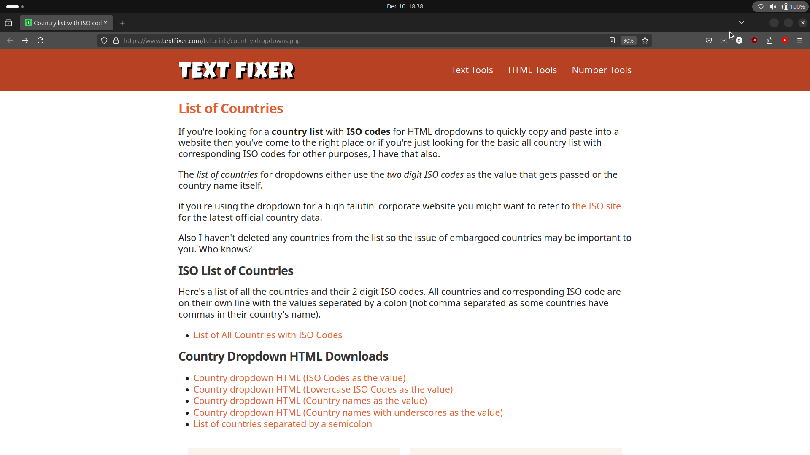
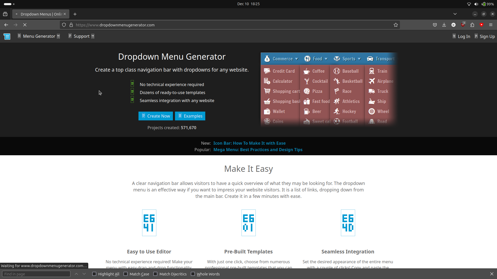
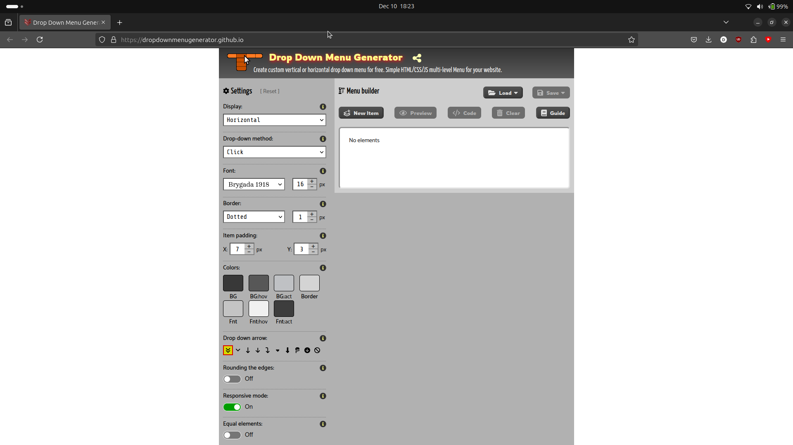
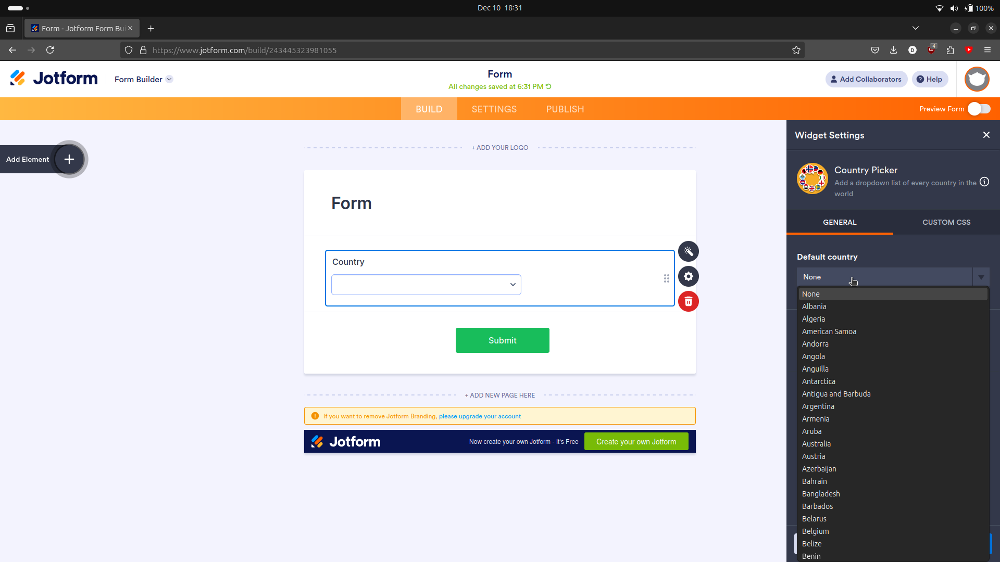

# NAME: TBD

This project aims to create a tiny web tool for quickly configuring "country" and "nationality" dropdown menus with sensible presets for common use cases.

The goal is to enable users to configure dropdown menus with these presets and then easily copy the code to use in their projects.

## Name ideas 💡

(in no particular order)

- CountryPickr (countrypic.kr maybe possible thanks to the nice korean TLD)
- SaneCountryPicker
- countryPickerConfig
- sensibleCountryPicker
- CountryUI
- simpleSelect
- CountryKit
- saneCountr.ee (Love for Estonia)

TODO: look up the availability of these names as domains using the `.com`, `.dev`, `.tools` and `.io` TLDs.

### Tech

Static page, no backend, no database, no cookies, no ads, no bullshit.

Should be running for 5 years with minimal maintenance.

HTML + css + vanilla js could be enough here and would likely "age" best. But there will some state management needed to track based on the user's configuration and update other components, so a meta-framework set up to produce a optimized static site makes sense. I want to aim for the smallest possible bundle size, so I would prefer to avoid React, Angular, or Vue.

Preact, the smaller brother of react (with less features then the big bro), could be a good fit. However I have heard very good things about SolidJS, which is a very small and fast framework which works without a virtual DOM and should be even faster. Lets go for that and use Astro as the static site generator.

## History

Over dinner, Ed mentioned that he had an idea for a  little dev tool that would make it easier to create "country" and "national" dropdowns for forms. I had suffered the pain of "country picking" a few days before. I was filling out my nationality on google form and entered a endless scroll back on forth, questioning my identity and existence. I couldn't find what I was looking for, I found Welsh, but English was no where to be seen. Typing did not help at all, it was not reacting to my key stroke, I was stuck in a loop. Alas I spot British and I was saved.

I lost precious time in this process. Surely I’m not alone.

Developers and the public, often have to create forms that require users to select their country, and there should be a simple way to do this.

The form data is often processed by other systems, and it can only be a positive when that data is clean, consistent and easy to process. Having a tool with some preset sane defaults, won't stop disputes on what constitutes a country, but would be a great help for the job of data inputting.

## The bigger Problem: la context

Encoding geographical places is a hard problem. Countries are disputed and there will never be one list to rule them all.

However, there are common use cases that could be addressed with a tool offering a configurable list of countries and nationalities as a starting point, to hack on.

There are already many approaches to standardize the list of countries and nationalities, in fact THE authority (*make some noise*), the International Organization for Standardization or ISO for short, has a few lists that nicely links the names of countries with a unique country_code, top level domains, and more... but  they are far from perfect

(Challenge to the reader, to think the problem through and come up with your own rules for a defention of a country and a list of edge casses ).

The go to [ISO 3166](https://en.wikipedia.org/wiki/List_of_ISO_3166_country_codes) country list standard is a good starting point. But even this has some nuances...

We may think this is a good list to use in the problem of "pick a country" dropdowns, but lets think this through.

Do you know about a island called "Bouvet Island"? It is a uninhabited island in the South Atlantic Ocean,1,870 km (1,160 mi) east of the South Sandwich Islands, and it is a territory of Norway. It has a country code, but it is not a country. How many people do you think would select this uninhabited island in a dropdown? Is it worth the space?

Or what about the "United Kingdom"? It is not listed as a country in the ISO 3166 list, but instead lists "England", "Scotland", "Wales", and "Northern Ireland" as separate countries. This is not ideal for many use cases.

Also, maybe you don't want to go full global scale and instead want to focus on a specific region, like the European Union. The EU is not a country, but it is a region that has a unique set of countries that are part of it. This is a quite (albeit there are nunances everywhere you look) common use case.

Avoiding the philosophy of what is  acountry and the politics of coming up with a list.. I think there is room for a simple and useful tool that provides sane presets for the most common use cases and outputs the data and code needed to create a "country" dropdown.

The tool should remain simple and should aim to be useful for developers and non-developers alike. The UI should be easy to use and understand. Most importantly, the web tool should be bombproof and last 5 years without any maintenance.

## Existing solutions

### Similar projects

Add to calendar - [addtocalendar](https://addtocalendar.com/) (config tool for making buttons, dropdowns and links for "add to calendar" magic.)

### dev tools

[https://react-select.com/home](https://react-select.com/home) - A react component for creating dropdowns. No presets. Preview. Configurable options. NPM package. Code snippets to add to a react project.

[https://www.textfixer.com/tutorials/country-dropdowns.php](https://www.textfixer.com/tutorials/country-dropdowns.php) - Links to code which has the html code for a dropdown with a simple list of countries. No configurable presets. No preview. Otherwise, nice style and simple.

[https://www.dropdownmenugenerator.com/](https://www.dropdownmenugenerator.com/) - Very bad and slow site. It is a generator for dropdown menus, but it is not specific to countries or nationalities. And looks like it was made in 2005.

[https://dropdownmenugenerator.github.io/](https://dropdownmenugenerator.github.io/) - Overly complex UI, no country presets.

[https://demo.mobiscroll.com/javascript/select/country-picker#](https://demo.mobiscroll.com/javascript/select/country-picker#) - A country picker using the ui framework
dropdown with flags and ISO codes. No configurability. Preview. Code snippets for different frameworks.

[https://country.driaug.com/](https://country.driaug.com/) - A react country selector with flags and ISO codes. No configurability. Preview. Search. LOOKS GOOD!

[https://uiwjs.github.io/react-codemirror/#/](https://uiwjs.github.io/react-codemirror/#/) - A configurable code editor for react. Preview. Knobs and buttons to configure things. Code snippets for different frameworks.

^^ This could be a good way to display and style the code snippets ;)

 - A code snippet "image" generator with a nice UI. Theme presets. Nice looking.

Code is available on github: [https://github.com/raycast/ray-so/tree/main/app/(navigation)/(code)](https://github.com/raycast/ray-so/tree/main/app/(navigation)/(code))

### FAAS (forms as a service) platforms

[https://www.jotform.com/widgets/country-picker](https://www.jotform.com/widgets/country-picker) - A country picker widget for JotForm, which is a FAAS (forms as a service) platform.

### stackoverflow questions

- [https://stackoverflow.com/questions/249392/which-iso-3166-country-code-should-i-use-for-the-united-kingdom](https://stackoverflow.com/questions/249392/which-iso-3166-country-code-should-i-use-for-the-united-kingdom) - A question about which ISO 3166 country code to use for the United Kingdom. The top answer is a good example of the confusion that can arise from using the ISO 3166 list as a source of truth for countries.

### online lists

- [https://www.iso.org/iso-3166-country-codes.html](https://www.iso.org/iso-3166-country-codes.html) - The International Organization for Standardization (ISO) 3166 standard provides a list of countries and their codes. This is the go-to list for many developers.
- [https://datahub.io/core/country-list](https://datahub.io/core/country-list) - A csv list of countries, one per line with ISO 3166-1 codes.

### github

- [https://github.com/dillidon/alerts-and-pickers?tab=readme-ov-file#country-picker](https://github.com/dillidon/alerts-and-pickers?tab=readme-ov-file#country-picker) - Swift implementation. UIAlertController and pickers based on it: Telegram, Contacts, Location, PhotoLibrary, Country, Phone Code, Currency, Date. 6k stars.
- [https://github.com/xcarpentier/react-native-country-picker-modal](https://github.com/xcarpentier/react-native-country-picker-modal) - A country picker for React Native. 1k stars.
- [https://github.com/umpirsky/country-list](https://github.com/umpirsky/country-list) - A list of all countries with names and ISO 3166-1 codes in all languages and data formats. 5k stars.
- [https://github.com/nicklockwood/CountryPicker](https://github.com/nicklockwood/CountryPicker) - A country picker for iOS. 750 stars.
- [https://github.com/joielechong/CountryCodePicker](https://github.com/joielechong/CountryCodePicker) - A country code picker for Android. 300 stars.
- [https://github.com/countries/countries](https://github.com/countries/countries) - Ruby gem containing all sorts of useful information about every country packaged as convenient little country objects. It includes data from ISO 3166 (countries and states/subdivisions ), ISO 4217 (currency), and E.164 (phone numbers). 2k stars.
- [https://github.com/pioz/countries](https://github.com/pioz/countries) - Go port of the above. 100 stars.
- [https://github.com/rinvex/countries](https://github.com/rinvex/countries) - PHP package for retrieving country details with flexibility. A whole bunch of data including name, demonym, capital, iso codes, dialling codes, geo data, currencies, flags, emoji, and other attributes for all 250 countries worldwide at your fingertips. 1.7k Stars.
- [https://github.com/datasets/country-list](https://github.com/datasets/country-list) - List of all countries in the world with their ISO 2 digit codes (ISO 3166-1) as CSV and JSON. 150 stars.
- [https://gist.github.com/kalinchernev/486393efcca01623b18d](https://gist.github.com/kalinchernev/486393efcca01623b18d) - A list of countries, one per line.

### npm packages

- [country-list](https://www.npmjs.com/package/country-list) - A simple list of countries for use in select inputs. 160k weekly downloads.
- [country-and-timezone](https://www.npmjs.com/package/country-and-timezone) - A simple list of countries and timezones for use in select inputs. 500k  weekly downloads.
- [country-flag-icons](https://www.npmjs.com/package/country-flag-icons) - A simple list of countries with flags for use in select inputs. 800k weekly downloads.

### Other pages on the web where you can get code

- [https://demo.mobiscroll.com/javascript/select/country-picker#](https://demo.mobiscroll.com/javascript/select/country-picker#) - A country picker dropdown with flags and ISO codes.
- [https://www.geodatasource.com/software/country-region-dropdown-menu](https://www.geodatasource.com/software/country-region-dropdown-menu) - A JS Lib with a easy to use country picker drop down based on ISO 3166

### Inspiration

- [https://anvaka.github.io/how-to-be-rich/about.html](https://anvaka.github.io/how-to-be-rich/about.html) I like the simple html + css style of this site.

## Features

Configurable Options:

(The idea would be to reduce the number of options to the minimum necessary to make the tool useful and have some good "sane" presets)

- Select preset list
  - iso 3166
  - EU
  - AMEA
  - Balkans
  - etc...
- Custom list.
  - user typed list
  - optional validation
  - quick add/remove continents, country groups, etc.
- Enable/disable flags (emoji, png, svg)
- Display formats (full name, short name, ISO code, dialing code, currency etc.)
- Sorting
  - Alphabetical
  - By population
  - By continent
  - By area size
- Typing behavior
  - Autocomplete
  - Jump to first letter
- Enhanced Search:
  - "Did you mean?" suggestions for misspellings or alternative names like "UK" vs. "United Kingdom" vs "Great Britain".
  - different language results (e.g. "Deutschland" for "Germany")
  - fuzzy search for typos  
- Dropdown styling
  - color
  - size
  - shape
  - border
  - shadow
- Language
  - English
  - German
  - etc.

User Interface:

- Config knobs
- Preview of dropdown
- code snippet for configuration dropdown
  - HTML
  - JS
  - react component
  - vue component
  - angular component
  - etc.
- Copy Code snippet to clipboard button and UI feedback
- returned object snippet for the previewed dropdown (eg: the json object that represents the selected item in the previewed dropdown)
- "share this config" button to share the current configuration with a link (encode the configuration in the URL)
- Globe map with selected countries highlighted (This might be more of a complication than a feature)
- "ABOUT"
- "CONTACT GitHub ect"

## Random thoughts down the rabbit hole of thought

Would be cool to make a regex101 for country codes + presets + map of countries

Phantom islands through the ages show how our view of the world has changed. People used to list islands that were not there, and for sure not visited by the map users. The same goes for some countries in a country picker.
